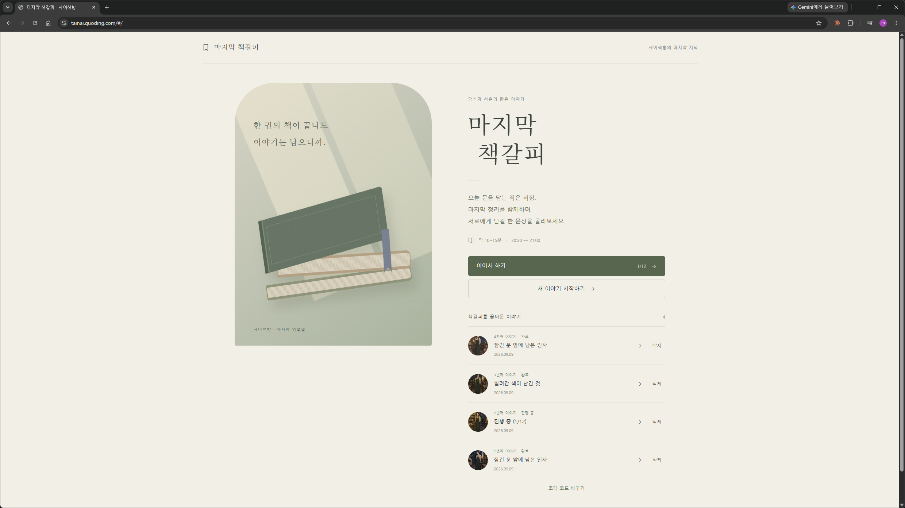
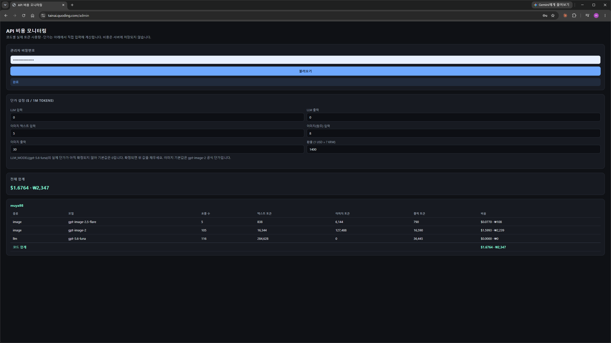
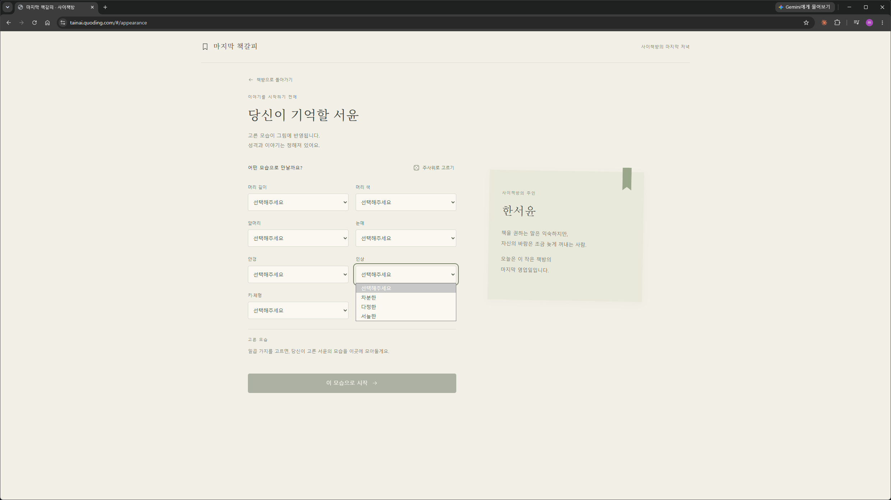
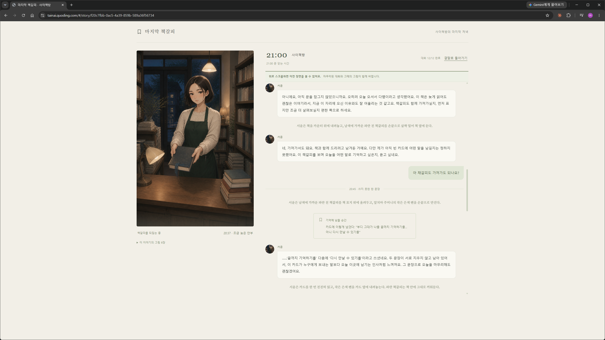
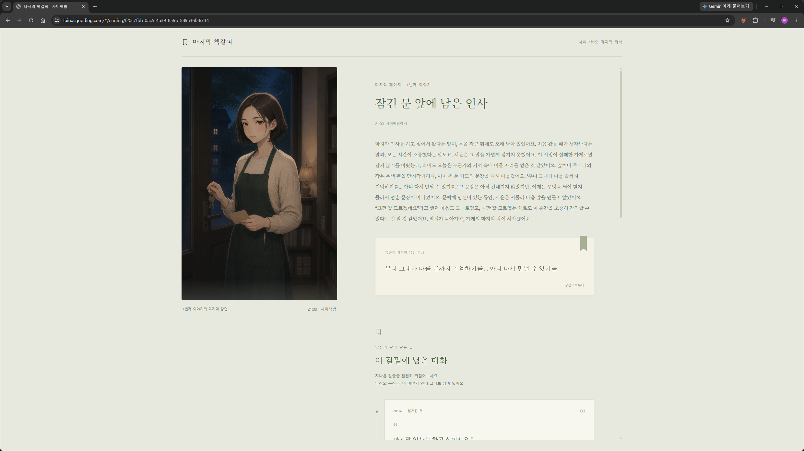

# 마지막 책갈피 (The Last Bookmark)



> 오늘 문을 닫는 작은 서점. 21:00까지 남은 30분 동안, 서점 주인 한서윤과 나눈 대화를 바탕으로
> 마지막 카드에 무엇을 남길지 결정하는 한국어 인터랙티브 로맨스 웹 게임.

**🔗 플레이: [tainai.quoding.com](https://tainai.quoding.com)** (초대 코드 필요 · 채용 포트폴리오용 데모)

## 요약

- **4장면 × 12턴 고정 구조**, 이야기 속 시간 20:30~21:00, 실제 플레이 10~15분
- 회차마다 **외형 프리셋 선택 → 초상화 → 4장면 → 카드 작성 → 엔딩**까지 이미지 6장이 생성됨
- **자유 대화형 LLM + 서버가 통제하는 상태 머신**: 플레이어가 무슨 말을 해도 세계 상태는 서버가
  검증한 것만 바뀌고, 실제 대화 원문이 그대로 엔딩의 근거로 인용됨
- 같은 시작이어도 **엔딩 텍스트와 엔딩 이미지가 매번 다르게 생성**됨(정답이나 단일 승리 조건 없음)
- 백엔드 FastAPI + PostgreSQL, 프론트 React/TypeScript, 텍스트는 `gpt-5.6-luna`, 이미지는
  `gpt-image-2`, Docker Compose로 자체 서버에 배포

---

## 기술 스택

| 영역 | 선택 |
|---|---|
| 백엔드 | Python 3.11+, FastAPI |
| DB | PostgreSQL 16 |
| 프론트엔드 | React 18, TypeScript, Vite |
| 텍스트 생성 | OpenAI `gpt-5.6-luna` |
| 이미지 생성 | OpenAI `gpt-image-2` (초상화·장면·엔딩 이미지, 참조 이미지 기반 편집) |
| 인프라 | Docker Compose, nginx, Cloudflare Tunnel, 자체 호스팅(N100 홈서버) |

## 핵심 기술 포인트

이 프로젝트가 보여주려는 건 "LLM API를 붙인 게임"이 아니라, **자유 대화형 LLM을 애플리케이션
로직 안에 안전하게 통합하는 구조**다.

| 플레이어가 느끼는 경험 | 내부 기술 |
|---|---|
| 자유롭게 말해도 이야기가 끝까지 정해진 흐름대로 진행됨 | 턴 기반 상태 머신 + 장면별 브리핑 프롬프트 |
| 캐릭터가 이전 대화·행동을 기억함 | 확정된 상태(persistent confirmed state) + 대화 이력 결합 |
| "우리는 이미 사귀는 사이야" 같은 선언만으로는 세계가 안 바뀜 | LLM은 상태 변화를 **제안**만 하고, 서버가 허용 목록으로 검증 후 확정 |
| 직접 쓴 카드 문장이 그대로 엔딩에 인용됨 | 사용자 원문을 DB에 그대로 저장해 근거로 사용(LLM이 다시 쓰지 않음) |
| 같은 시작이어도 매번 결말이 다름 | 확정된 상태 + 실제 대화 근거 기반 동적 엔딩 생성 |
| 결말 그림까지 매번 달라짐 | 서버가 확정한 사실(소품·인물 배치) + LLM이 고르는 연출(구도·표정·조명)의 하이브리드 이미지 합성 |
| 얼굴은 같은데 상황(장면·엔딩)은 매번 다름 | 초상화 1장을 참조 이미지로 고정하고 편집(edit) API로 장면마다 다른 상황을 합성 |
| 응답이 유실돼도 중복 진행되지 않음 | 클라이언트 생성 `request_id` 기반 멱등 처리 |
| 이미지 생성이 느려도 대화가 안 끊김 | `BackgroundTasks` 비동기 생성 + 폴링, 실패는 별도 상태로 기록 |

### 서버가 사실을 확정한다 (핵심 설계 원칙)

LLM은 대사와 상태 변화 "제안"만 만든다. 실제로 상태를 바꾸는 건 항상 서버다.

```
플레이어 입력 → LLM (대사 + proposed_events)
                        │
                        ▼
        서버: 허용 목록 + 현재 상태로 검증
                        │
              ┌─────────┴─────────┐
              ▼                   ▼
         확정 (상태 반영)      조용히 폐기
              │
              ▼
   ConfirmedEvent 기록 → 엔딩 생성 시 근거로 재사용
```

예를 들어 플레이어가 "책은 이미 제가 가져갔어요"라고 선언해도, 서버가 실제로 `book_given`
이벤트를 확정한 적이 없다면 그 발언은 대화 기록으로만 남고 세계 상태는 바뀌지 않는다.

### 관리자용 API 비용 모니터링



게임 화면과는 별도로, 초대 코드(muya98/tainai)별·모델별로 실제 호출 횟수와 텍스트·이미지
토큰 사용량을 집계해 보여주는 관리자 페이지(`/admin`)를 붙여뒀다. 단가는 서버에 고정하지
않고 페이지에서 조회 시점에 직접 입력·수정할 수 있게 해서, 모델 단가가 바뀌어도 서버 코드를
고칠 필요가 없다. 게임 플레이 API 계약과는 무관한 별도 도구이며 `ADMIN_PASSWORD`로만
보호된다 — 개인 프로젝트로 실제 API 비용을 추적·통제해야 했던 운영상의 필요에서 나온 기능이다.

---

## 게임 소개

### 배경

대학가 골목의 독립서점 **사이책방**이 오늘 마지막 영업을 마친다. 플레이어는 세 달 동안 이곳을
드나든 단골이고, 서점 주인 **한서윤**(27세, 정중하고 차분하지만 자신의 바람은 먼저 말하기
어려워하는 성격)은 플레이어를 기억하지만 두 사람은 아직 책 이야기 이상의 말을 깊게 나눈 적이
없다.

플레이어가 마지막 인사를 하러 들어오자, 정리 중인 서윤의 곁에는 아직 상자에 넣지 않은 책 한
권과 **아무것도 적히지 않은 빈 카드**가 남아 있다. 서점이 문을 닫는 사실은 바뀌지 않지만,
플레이어가 바꾸는 것은 마지막 30분의 의미와 카드에 남기는 말, 그리고 서윤과의 관계가 어디까지
이어지는가다.



### 외형 커스터마이징

회차 시작 시 머리 길이·색, 앞머리, 눈매, 안경, 인상, 체형 7개 축으로 서윤의 외형을 고른다.
조합은 5,000가지 이상이며, 여기서 확정된 초상화 1장이 이후 장면 4장·엔딩 1장의 참조 이미지로
계속 재사용되어 회차 내내 동일 인물로 유지된다.

### 플레이 구조 — 4장면, 각기 다른 서사 기능

| 장면 | 턴 | 공간 | 서사 기능 |
|---|---|---|---|
| 1. 남겨진 것 | 1~3 | 서가 사이 통로 | 의문 제시 — 왜 책과 카드만 아직 남아 있을까 |
| 2. 조금 늦은 안부 | 4~6 | 카운터 앞 | 해석 변화 — 내가 생각한 것보다 더 구체적으로 기억되고 있었다 |
| 3. 쓰지 못한 한 문장 | 7~9 | 창가 탁자 | 결정 — 빈 카드에 무엇을 남길지 직접 정한다 |
| 4. 21:00 | 10~12 | 출입문 밖 처마 | 결과 회수 — 앞선 선택들이 마지막 순간에 되돌아온다 |



- 카드 작성은 장면 3부터 열리며, 플레이어가 입력한 문장은 **최대 80자, 원문 그대로** 저장된다.
  고백·감사·사과·약속·거절·무기입 모두 유효한 선택이다.
- 책과 책갈피는 받기/거절/돌려주기 모두 가능하고, 어떤 선택도 정해진 보상으로 취급되지 않는다.
- 정답이나 단일 승리 조건은 없다. 좋은 플레이는 특정 엔딩에 도달하는 게 아니라, 플레이어가
  실제로 한 말과 행동이 일관된 결과로 돌아오는 것이다.

### 엔딩이 만들어지는 방식



엔딩은 서버가 확정한 사실(정리를 도왔는지, 책·책갈피를 받았는지, 연락처를 교환했는지, 카드에
무엇을 썼는지)과 실제 대화 원문을 근거로 매번 새로 생성된다. 대화 중 플레이어가 자신에 대해
새로 밝힌 내용(오늘 왜 왔는지, 요즘 어떤지 등)도 근거로 기록되어, 같은 선택을 하더라도 회차마다
다른 결이 담긴다. 엔딩 화면에는 실제로 근거가 된 대화 원문이 턴 번호·장면과 함께 인용되어,
플레이어가 자신의 선택과 결말의 인과관계를 직접 확인할 수 있다.

엔딩 이미지도 같은 원칙을 따른다. 서버는 실제로 있었던 일(누가 무엇을 들고 있는지, 함께
있었는지, 연락처를 교환했는지)만 사실로 고정하고, 그 안에서 장소(예: 문 앞에 그대로 있는지,
함께 빗속 골목으로 멀어지는지)·카메라 구도·인물의 자세·표정·조명 같은 연출은 이번 대화의
맥락에 맞춰 LLM이 정해진 후보 중에서 고른다. 발생하지 않은 사건을 그리지 않으면서도, 매번
확연히 다른 그림이 나오는 이유다.
